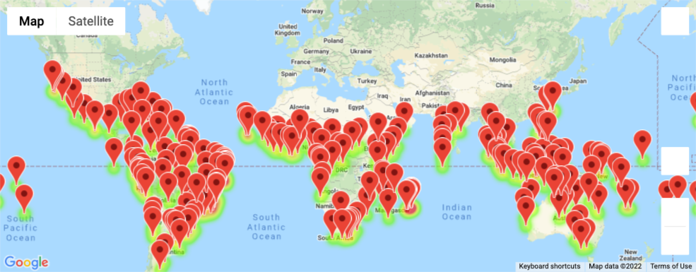
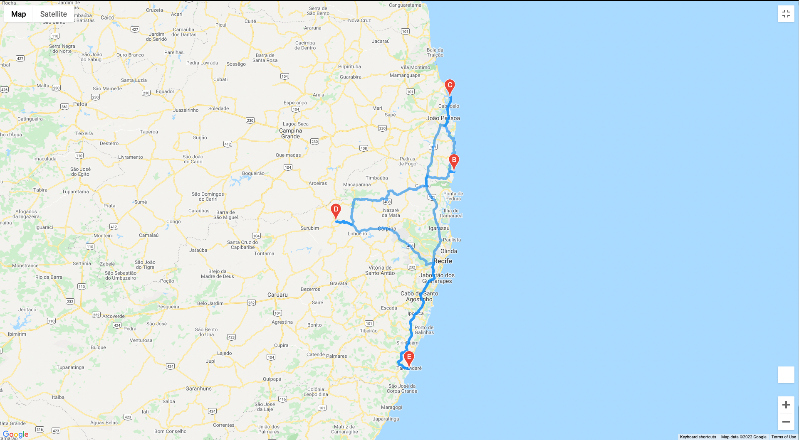
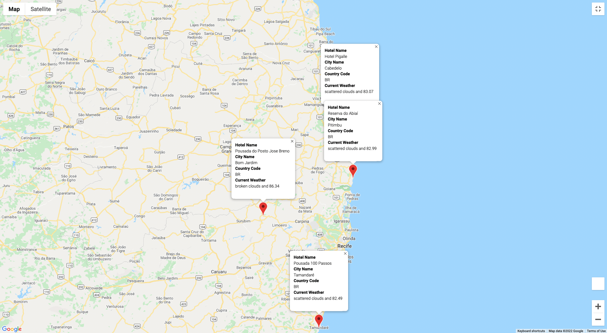

# World_Weather_Analysis

The following project aims to recommend ideal hotels based on clients' weather preferences.

The project is broken up into three primary elements:

### Weather Database
A script leveraging the CityPy module and API calls to OpenWeatherMap.com to generate hundreds of locations around the globe, and the current weather conditions for those locations.

### Vacation Search
A script leveraging Google Maps API calls that takes user temperature preferences, and creates an interactive map of the locations that fit the given criteria.

### Vacation Itinerary
A script that takes a select group of locations and builds an interactive map with a route between the selected cities. 

